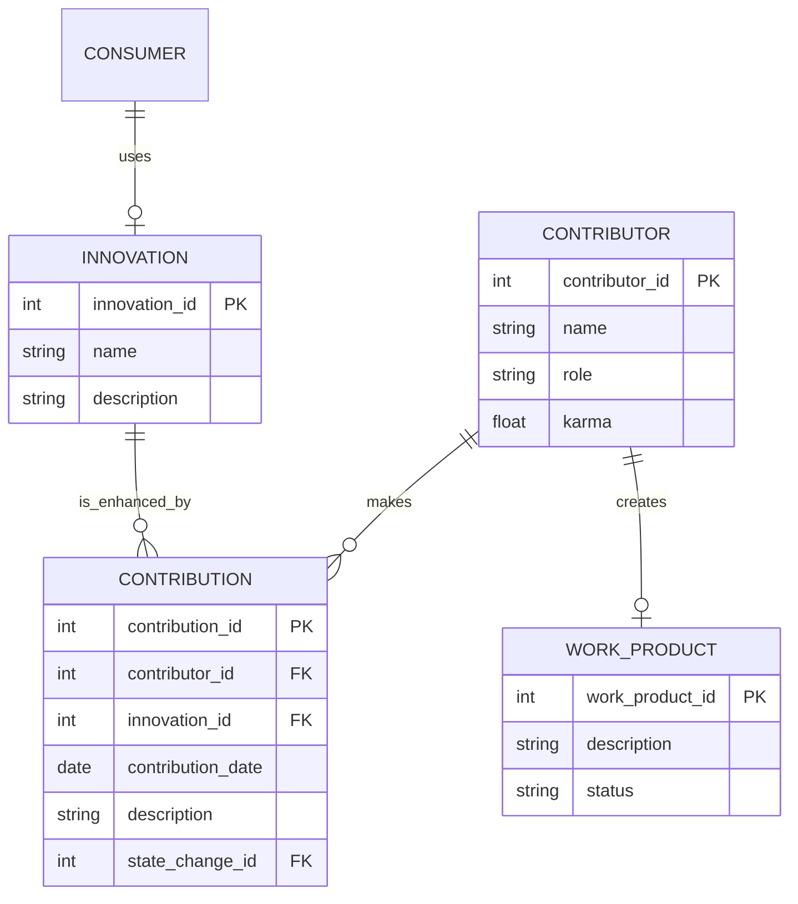

**Title:** Dreamcatcher: An Innovative Framework for Permissionless and Transparent Collaboration

**Abstract:**

This paper presents the Dreamcatcher platform, an innovative system designed to facilitate permissionless, fair, and transparent innovation among diverse actors, including contributors, consumers, and pre-buyers. The platform integrates sophisticated data management techniques and leverages blockchain technology to ensure transparent tracking of contributions and equitable reward distributions. The underlying architecture and operational entities of Dreamcatcher are discussed, demonstrating its potential to redefine collaborative innovation dynamics and foster creative engagements in varied fields.

---

**1. Introduction**

In the modern landscape of innovation, collaborative frameworks have emerged as essential engines of creativity and problem-solving. Existing collaborative platforms often introduce barriers that prevent seamless engagement among diverse contributors. Dreamcatcher is conceived as an open framework that empowers individuals to co-create innovations without centralized control while ensuring accountability and recognition for their contributions. This paper elaborates the systemic architecture of Dreamcatcher, highlighting its entities, interactions, and inherent governance mechanisms.

---

**2. Background and Context**

**2.1. Collaborative Innovation**

The rise of collaborative innovation is facilitated by advancements in technology and an increasing shift towards decentralized processes. Collaborative models offer numerous advantages, such as enhanced creativity, efficiency, and collective intelligence. However, they often grapple with issues of trust, recognition, and governance, necessitating comprehensive solutions that address these challenges.

**2.2. The Role of Blockchain Technology**

Blockchain technology’s immutable nature provides a robust foundation for decentralized systems, offering solutions that prioritize transparency and traceability. This characteristic is particularly relevant in innovation contexts where the authenticity of contributions and equitable reward distribution is paramount.

---

**3. System Architecture of Dreamcatcher**

Dreamcatcher is built upon a well-defined entity-relationship model (ERM) that organizes its core components, interactions, and permissions. The primary entities include Contributors, Contributions, Consumers, Innovations, and Work Products, among others. Each entity is meticulously defined to capture its attributes and relationships, supporting effective collaborative dynamics.

### 3.1. Entity Definitions

| Entity           | Description |
|------------------|-------------|
| **Contributor** | Individuals or entities that provide input into the innovation process, characterized by attributes such as name and role. |
| **Contribution** | Recorded efforts that enhance Innovations, tied to specific Contributors and tracked through state changes. |
| **Consumer** | Users who utilize or benefit from the innovations created. |
| **Innovation** | Represents the project or concept being developed. Enhanced by contributions and utilized by consumers. |
| **Work Product** | Represents specific goals or objectives formed through collaborative processes. |

### 3.2. Entity Relationship Diagram (ERD)

To illustrate the relationships among the entities, the following ERD summarizes the interactions within the Dreamcatcher platform:

---

**4. Interaction Dynamics Among Entities**

This section provides a detailed exploration of the interactions among the different entities within the Dreamcatcher ecosystem:

1. **Contributors** create **Contributions** that enhance specific **Innovations**. The relationship is characterized as:
   - **CONTRIBUTOR** "makes" **CONTRIBUTION**: This signifies that contributions originate from contributors, who actively engage in the innovation process.

2. **Contributions** are linked to **Innovations**:
   - **INNOVATION** "is enhanced by" **CONTRIBUTION**: This indicates that contributions are integral to the evolution and improvement of innovations.

3. **Work Products** are outputs of collaborative efforts driven by contributors:
   - **CONTRIBUTOR** "creates" **WORK_PRODUCT**: This interaction emphasizes that contributors play a direct role in the formation of work products that result from collaborative engagements.

4. **Consumers** benefit from and utilize **Innovations**:
   - **CONSUMER** "uses" **INNOVATION**: This relationship highlights the end-user perspective, showing how internal innovation can translate to consumer benefits.

---

**5. Permission and Governance Model**

Dreamcatcher operates under a clearly defined permission model aimed at balancing autonomy and oversight. Table 2 outlines the permission categories delineating what actions each type of actor can perform, ensuring effective governance.

| Actor        | Permissions |
|--------------|-------------|
| Contributor  | Create, modify, enhance Contributions. |
| Consumer     | View Innovations only. |
| Pre-buyer    | Invest in projects via Escrow without altering the Innovation process. |
| Platform Admin| Oversee and manage the entire system, including entities and permissions. |

Table 2: Permission Model

---

**6. Implications for Collaborative Innovation**

The Dreamcatcher platform has profound implications for collaborative innovation. Its architecture permits fluid participation, allowing individuals or entities to engage without the impediments typical of traditional models. Moreover, the platform's focus on transparency and fairness promotes trust among participants, essential for creative collaborations.

### 6.1. Benefits

- **Increased Accessibility**: By removing centralized control, the platform invites more participants to join the innovation journey.
- **Transparent Recognition**: Contributions are recorded and attributed fairly, paving the way for equitable rewards.
- **Enhanced Collaboration**: The ecosystem fosters collaborative dynamics among diverse actors, leading to superior creative outputs.

---

**7. Future Directions**

As the Dreamcatcher platform continues to evolve, future research should explore its application across various sectors. Potential areas of focus include:

- **Utilization of AI**: Leveraging machine learning algorithms to enhance the evaluation mechanisms for contributions.
- **Greater Blockchain Integration**: Exploring additional blockchain functionalities to improve security and transparency.
- **Cross-Sector Collaborations**: Implementing the Dreamcatcher model in various fields, including healthcare, education, and environmental studies, to assess its versatility and scalability.

---

**8. Conclusion**

Dreamcatcher provides a robust framework for fostering permissionless collaboration, characterized by transparency and fairness. It effectively integrates modern technologies to reshape how innovation is approached and delivered. By enabling diverse contributions without centralized oversight, Dreamcatcher exemplifies the potential of collaborative innovation in a digitalized world.

---

**Acknowledgments**

We acknowledge the contributions of the participants in the Dreamcatcher platform and the support of innovative technology communities that continue to drive the boundaries of collaboration forward.

---

**References**

1. Crowston, K., & Howison, J. (2005). The social structure of free and open source software development. *Paper presented at the 38th Annual Hawaii International Conference on System Sciences*.
2. O'Reilly, T. (2005). What Is Web 2.0: Design Patterns and Business Models for the Next Generation of Software. *Communications & Strategies*.
3. Tapscott, D., & Williams, A. D. (2006). *Wikinomics: How Mass Collaboration Changes Everything*. Penguin Group.

---
