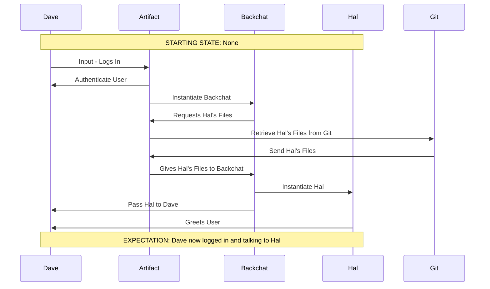

# Dreamcatcher Login sequenceTest

## Header
 - Name: LoginTest
 - Description: The sequence used to login a User to Dreamcatcher.
 - Entities Used:
    - Dave - The Contributor.
    - Artifact 
    - Backchat
    - Hal
    - Git

## Starting state
None.

## Expertation

Dave now logged in and talking to Hal

---

---