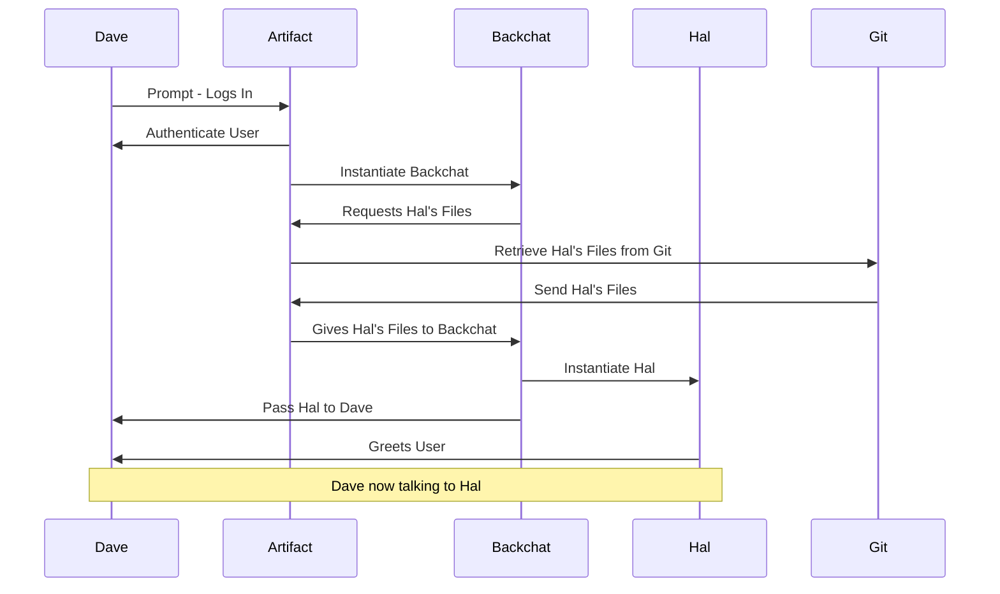

# Dreamcatcher Login Sequence

Name: Login
Description: the sequence diagram for loging a user into the Dreamcatcher

---

```mermaid
sequenceDiagram
    participant Dave
    participant Artifact
    participant Backchat
    participant Hal
    participant Git

    %% Login and Initial Setup
    Dave->>Artifact: Prompt - Logs In
    Artifact->>Dave: Authenticate User
    Artifact->>Backchat: Instantiate Backchat
    Backchat->>Artifact: Requests Hal's Files
    Artifact->>Git: Retrieve Hal's Files from Git
    Git->>Artifact: Send Hal's Files
    Artifact->>Backchat: Gives Hal's Files to Backchat
    Backchat->>Hal: Instantiate Hal
    Backchat->>Dave: Pass Hal to Dave
    Hal->>Dave: Greets User

    %% Note
    note over Dave, Hal: Dave now talking to Hal
```
---