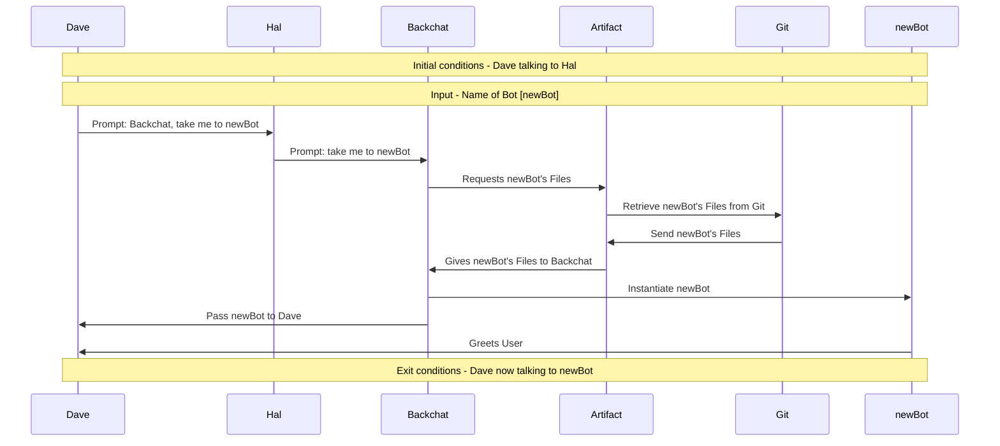

# Dreamcatcher Switch Bot, no data

Name: SwitchbotnoData
Description: this sequence is called every time a user (Dave e.g) asks to use a bot other than the one he's currently using, but does not provide any initial data to pass to that bot.

---

---